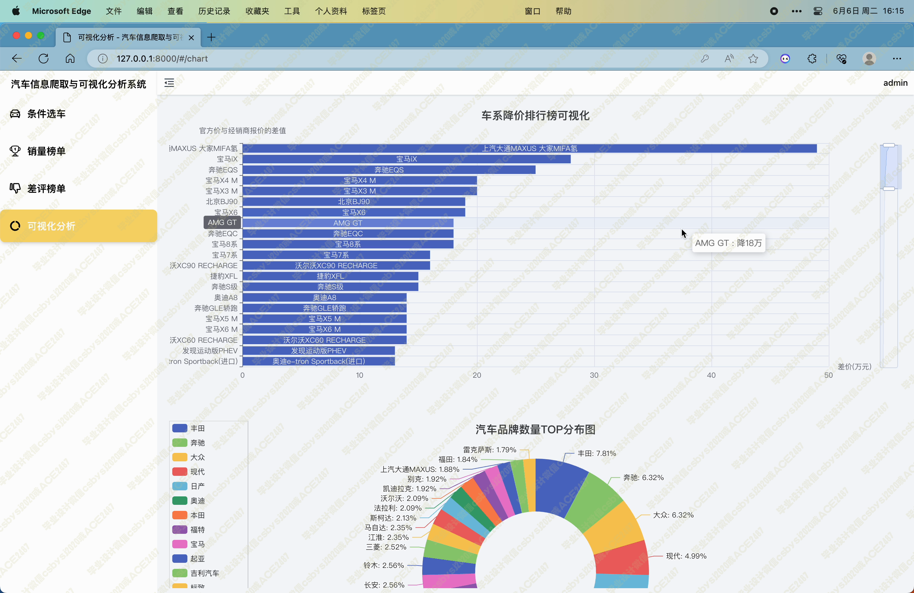

# 036 基于Python的汽车信息爬取与可视化分析系统-设计展示

> **代码有偿获取 可接受定制 微信联系方式: csbysj2020 或 ACE2487，备注(BS)**

> 

> 

## 介绍

这款汽车信息网站是基于多项技术和框架设计的全面的汽车信息展示及查询系统。其中，采用了Python Django框架和Scrapy爬虫技术实现数据的抓取和处理，结合MySQL数据库进行数据存储和管理，利用Vue3、Element-Plus、ECharts以及Pinia等前端技术实现了丰富的数据可视化展示和用户交互功能。
该系统主要包含以下几个模块：
1. Scrapy爬虫：使用Scrapy框架抓取了“懂车帝”网站的汽车及销量数据，以及“车质网”的汽车投诉数据，并将这些数据存储进MySQL数据库中，为后续的展示和查询提供了数据基础。
2. 条件选车模块：通过用户输入关键词、选择品牌、价格、燃料类型、座位、车型等条件，实现对车系的筛选，并提供了按总分、价格、舒适性、外观、配置、控制、动力、空间、内饰等维度对筛选结果的排序，并支持自动翻页功能。
3. 销量榜单模块：根据近一年、近半年以及每个月的车系销量数据进行统计，并展示排名，为用户提供参考。
4. 差评榜单模块：根据近一年、近半年以及每个月的车系问题投诉数据进行统计，并展示排名，同时可以筛选质量问题、服务问题、其他问题，为用户提供更加精准的信息。
5. 可视化分析模块：包括车系降价排行榜柱状图可视化(官方价减去经销商价格得到降差价)、汽车品牌数量TOP分布图(分析前30个品牌的车系数量的分布)、价格范围数量分布图(对分布在0-10万 10-15万 15-20万 20-25万 25-30万 30-40万 50万以上价格范围的车系数量进行分析)，为用户提供更加直观的数据呈现。
6. 车系详情页面：介绍了品牌、车系名、经销商报价、厂商报价、近一年销量排名、投诉量排名等基本信息，并展示了评分雷达图分析面板，分析车系的舒适性、外观、配置、控制、动力、空间、内饰六个维度，同时展示汽车数据面板和外观图片，以及该车型的所有投诉问题标签。使用ECharts展示了每个月的质量问题关键词、三种问题的每月投诉量走势图、每月车系销量走势图、每月销量排名走势图。
7. 后台管理模块：可以对所有数据进行增删改查的管理，方便管理员对数据进行维护和管理。
8. 用户登陆注册：用户可以通过注册登陆功能，实现个人信息的管理和保存。
综上所述，该汽车信息网站具有多项功能，不仅提供了全面的汽车信息查询和展示功能，同时也通过数据可视化的方式为用户提供了更加丰富的数据分析和决策支持，是一款集数据处理、UI设计、前端交互、后台管理等于一体的全面性汽车信息系统。

## 技术栈

python django django-simpleui scrapy mysql vue3 element-plus echarts vue-router pinia

## 视频

> **点击查看 \>\>\> [https://www.bilibili.com/video/BV118411o7Rc/](https://www.bilibili.com/video/BV118411o7Rc/)**

## 截图

